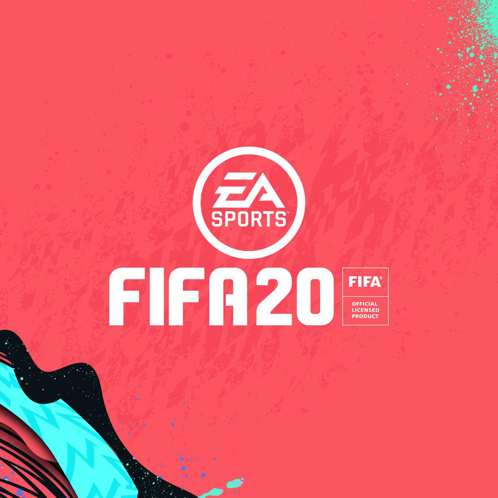

# Soccer-Player-Predictor

# En que consiste??

Consiste en predecir la media que tendran los jugadores de futbol el año siguiente

Tenemos descargados 6 datasets de Kaggle, hago el entrenamiento con 5 de ellos (temporadas 15 al 19) y el test con el ultimo (temporada 2020)

# Proceso:

limpiamos train, y test
Compruebo las columnas tipo objeto y les asigo valores relacionados entre si para tener la columna tipo numérica, como los países y equipos, según las clasificaciones fifa
my

# Entrenamiento:

Me centro en scikit-learn, son unas herramientas para predecir análisis de datos, para ello utilizo:
models = {
    "Linear": LinearSVR(),
    "neigbor":KNeighborsRegressor(),
    "boosting": GradientBoostingRegressor(),
    "boosting2": GradientBoostingRegressor(n_estimators=500),
    "boosting3": GradientBoostingRegressor(n_estimators=1000),
    "histboosting": HistGradientBoostingRegressor(),
    "histboosting2": HistGradientBoostingRegressor(learning_rate=0.2),
    "histboosting3": HistGradientBoostingRegressor(learning_rate=0.4),
    "forest": RandomForestRegressor(),
    "forest250": RandomForestRegressor(n_estimators=250),
    "forest350": RandomForestRegressor(n_estimators=350),
    "tree": DecisionTreeClassifier(random_state=0, max_depth=2)
}

Pruebo con H2oAutoML, buscará automáticamente modelos de machine learning que se ajustan a los datos y entrenaremos con el mejor:

# Conclusion:
XGBoost_1_AutoML_20200308_215025 da como ganador

#MySql Workbench, cargo el dataset y a través de Flask hago las peticiones
